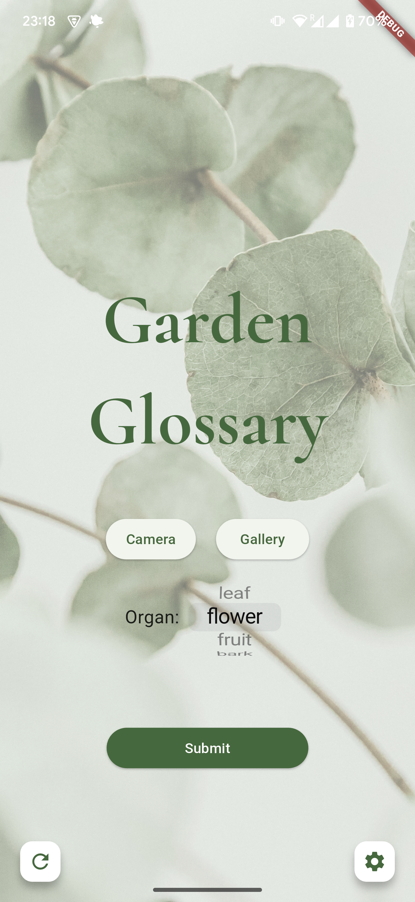
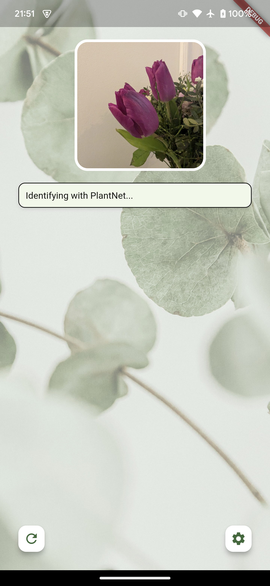

# Garden Glossary
Currently a work-in-progress, **Garden Glossary** is a mobile app that provides users with plant identification and key cultivation info, based on a photo upload.

The front-end is built using Flutter (Dart), and the back-end uses FastAPI (Python), which will be hosted on AWS Lambda in the future.

    
    

