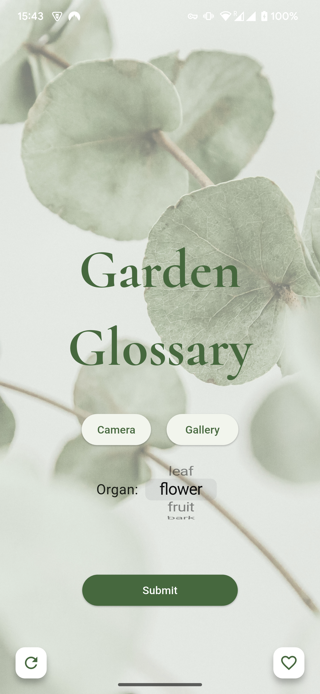
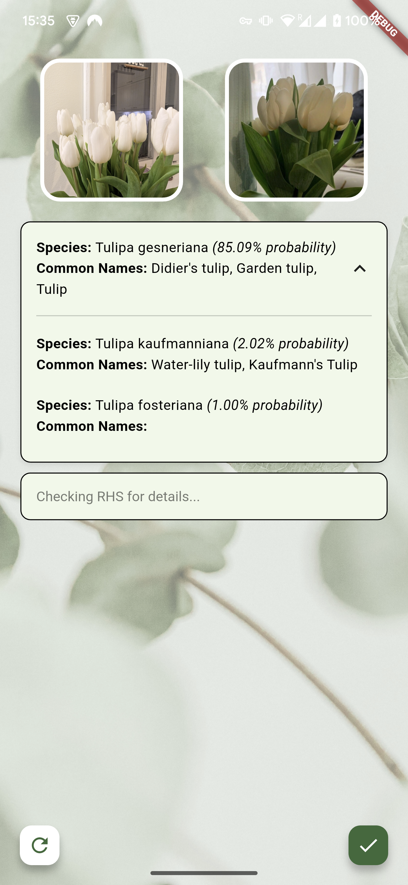
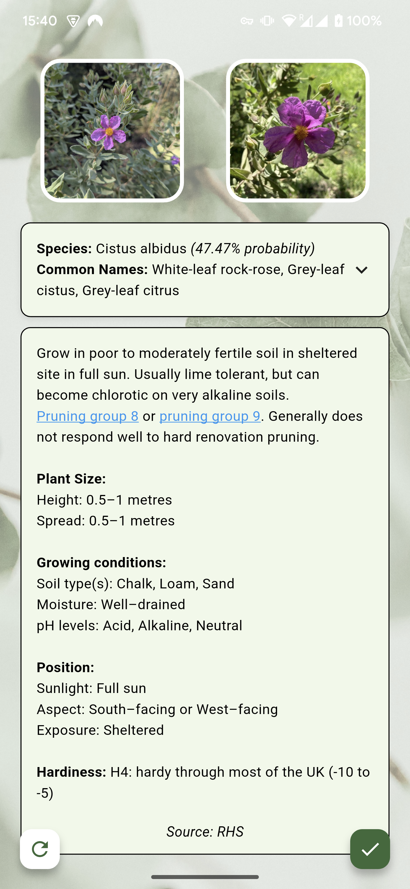

# Garden Glossary

[](https://shields.io/)
[](LICENSE)

Garden Glossary is a mobile app that helps users identify plants and access cultivation information through photo uploads. The app provides plant identification and key cultivation details sourced from the Royal Horticultural Society (RHS) website or Anthropic's Claude AI.

<div style="display: flex; flex-wrap: wrap; gap: 20px; justify-content: center;">
    
    
    
</div>

## Project Overview

This monorepo contains both the Flutter mobile application (frontend) and FastAPI service (backend) for the Garden Glossary project:

- **Frontend**: Flutter mobile app that allows users to capture or upload plant images and displays identification results and cultivation information.
- **Backend**: FastAPI service hosted on AWS Lambda that handles plant identification and retrieves cultivation details.

#### Repository Structure
```
garden-glossary/
├── frontend/         # Flutter mobile app
├── backend/          # FastAPI service on AWS Lambda
├── assets/           # Shared assets and documentation resources
├── .gitignore
├── LICENSE           # Project license
└── README.md         # This file
```

## Getting Started

For detailed setup instructions, refer to the individual READMEs in each directory:

- [Frontend README](./frontend/README.md)
- [Backend README](./backend/README.md)

### Prerequisites

* [Flutter SDK](https://flutter.dev/docs/get-started/install) (for the frontend)
* [Python 3.x](https://www.python.org/downloads/) (for the backend)
* [pip](https://pypi.org/project/pip/) (Python package installer)
* [npm](https://www.npmjs.com/get-npm) (for Serverless deployment of the backend)
* [Serverless CLI](https://www.serverless.com/framework/docs/getting-started/) (for backend deployment)
* AWS Account configured with necessary permissions.

### Development Workflow

1. Clone the repository:
   ```bash
   git clone https://github.com/jplimmer/garden-glossary.git
   cd garden-glossary
   ```

2. Set up and run the backend:
   ```bash
   cd backend
   # Follow instructions in backend README
   ```

3. Set up and run the Flutter frontend:
   ```bash
   cd frontend
   # Follow instructions in frontend README, including running different flavors of the app
   ```

## Deployment

### Backend

The backend is deployed to AWS Lambda using the Serverless Framework:

```bash
cd backend
serverless deploy
```

### Frontend

Currently the Flutter app can be built and installed manually (see the frontend README for detailed instructions), and will hopefully be available through app stores soon.

## License

[MIT License](LICENSE)